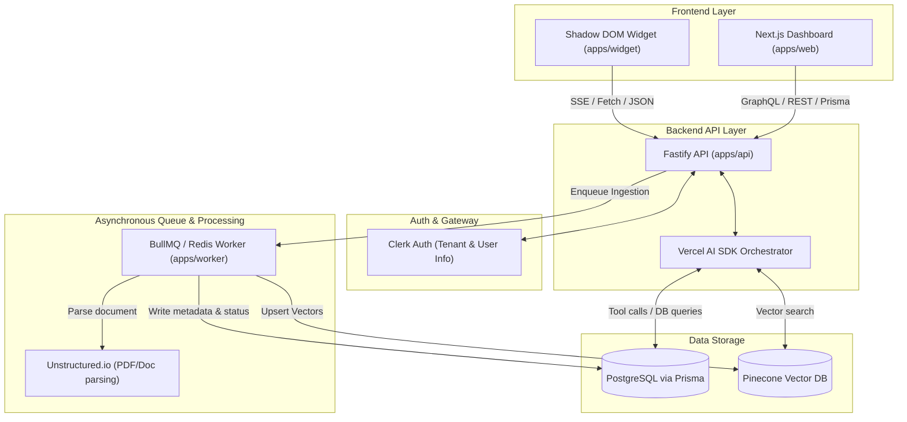
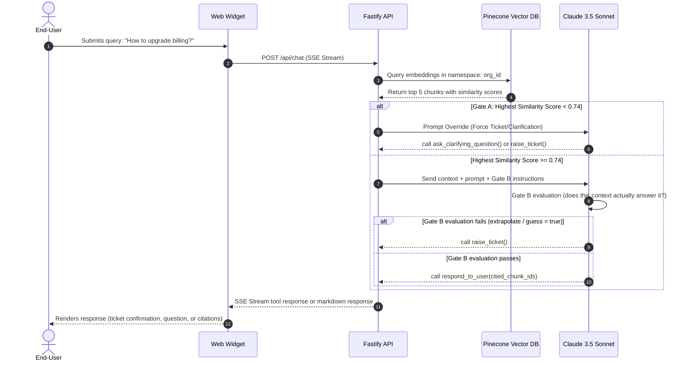
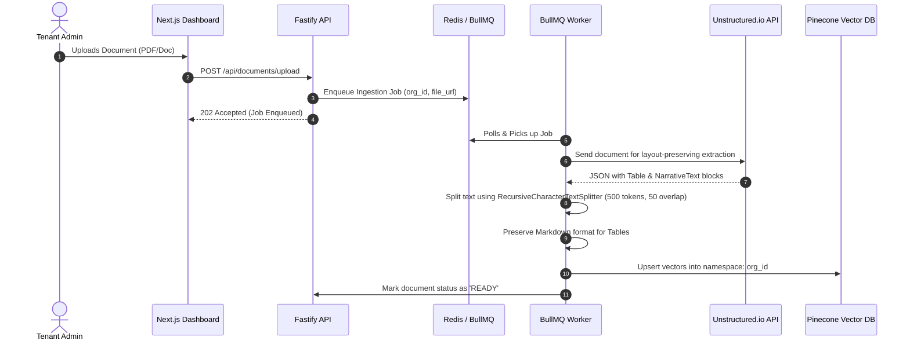

# Product Requirements Document (PRD)
## Aegis AI: Autonomous Customer Support & Closed-Loop Escalation Platform

**Document Version:** 1.0 (Detailed Specification)  
**Status:** Draft / Approved for Design Phase  
**Author:** Lead Product Engineer  
**Date:** June 21, 2026  

---

## 1. Executive Summary & Vision

Traditional RAG (Retrieval-Augmented Generation) chatbots suffer from a critical flaw: **they lack the capacity for doubt.** When asked a query for which they lack context, they extrapolate, hallucinate, and erode user trust.

**Aegis AI** is a B2B, multi-tenant customer support platform designed around an **Agentic Triage Loop**. Rather than serving as an unchecked answer generator, the AI operates as a Level-1 Support Dispatcher. It evaluates its own retrieval confidence and reasoning; if it cannot definitively resolve a query using cited institutional knowledge, it routes the conversation to a high-context human escalation loop. Once resolved by a support agent, the system automatically harvests the resolution, closing the knowledge gap.

### The Product Flywheel
```
User Query ──► Agent Doubt ──► Human Ticket ──► Human Resolution ──► Re-ingested as FAQ ──► Zero Doubt on next query
```

---

## 2. Target Personas

| Persona | Role | Key Goals | Key Pain Points |
| :--- | :--- | :--- | :--- |
| **Sam** | End-User (Customer) | Wants an instant, accurate answer or a reliable escalation ticket with a confirmed SLA. | Dead-end bots that hallucinate, waste time, and fail to provide human support options. |
| **Alex** | Support Responder | Wants the AI to handle the 75% mundane queries, leaving complex issues for humans. | Tickets that lack context or transcript history, forcing them to ask the user to repeat themselves. |
| **Morgan** | Tenant Admin (Buyer) | Wants high Deflection Rate %, high Escalation CSAT, and absolute data isolation between orgs. | Concern over data privacy leaks, compliance violations, and unpredictable AI behaviors. |

---

## 3. System Architecture & Boundaries

The system is deployed as a single **Turborepo TypeScript Monorepo** utilizing `pnpm` workspaces.

### Component Relationship Diagram



---

## 4. Functional Requirements

### Epic 1: The Autonomous Agent Loop (`apps/api`)
The decision engine governing the chat touchpoint.

#### REQ-1.1: Standardized Tool Arsenal
On every single user turn, the Vercel AI SDK instance must supply the Anthropic (Claude 3.5 Sonnet / Claude 3 Haiku) model with exactly four defined tools:
1. `search_knowledge_base({ query: string })`
   * *Description:* Queries Pinecone for matching knowledge chunks.
2. `ask_clarifying_question({ ambiguous_topic: string, options?: string[] })`
   * *Description:* Asks the user to clarify their request when multiple paths match.
3. `raise_ticket({ user_summary: string, user_email: string, urgency_guess: 'low' | 'med' | 'high' })`
   * *Description:* Creates an escalation ticket in PostgreSQL via Prisma.
4. `respond_to_user({ markdown_answer: string, cited_chunk_ids: UUID[] })`
   * *Description:* Sends a structured answer with mandatory references back to the user.

#### REQ-1.2: The Two-Stage "Doubt Gate"
The backend must enforce two distinct tripwires before permitting a `respond_to_user` execution:



* **Gate A (Deterministic Vector Similarity):** When `search_knowledge_base` returns its top 5 chunks, the Fastify wrapper inspects the similarity scores. If the highest score is `< 0.74` (configurable per organization), the LLM's payload is intercepted, and the system forces a prompt override:
  > *"Your retrieval confidence was low. You must choose to ask a clarifying question or offer to raise a ticket."*
* **Gate B (LLM Self-Assessment):** If Gate A passes, the LLM must execute an internal, un-rendered reasoning step:
  > *"Look at Chunk A and Chunk B. Do they explicitly contain the answer to the user's prompt, or would I have to extrapolate/guess? If guess = true, call raise_ticket."*

#### REQ-1.3: Mandatory Citations
If the agent chooses `respond_to_user`, the API schema validation (Zod) must reject the payload if `cited_chunk_ids` is empty, unless the query was flagged as "pure conversational pleasantry" (e.g., "Hello", "How are you?").

---

### Epic 2: The Ultra-Lean Embeddable Widget (`apps/widget`)
The customer-facing touchpoint injected into third-party DOMs.

* **REQ-2.1: Bundle Constraints:** The compiled JS snippet delivered to the CDN must be built via Vite (Library Mode) + Preact, strictly capped at `< 18KB` gzipped. It must not import the full Vercel AI SDK client; it will use native browser `fetch` and a lightweight Server-Sent Events (SSE) stream decoder.
* **REQ-2.2: Absolute CSS Containment:** The widget MUST mount its entire Preact tree inside an open `ShadowRoot` (Shadow DOM). Global styles on the host page (e.g., `* { box-sizing: content-box !important; color: red; }`) must have zero visual impact on the chat widget.
* **REQ-2.3: Zero-Friction Bootstrapping:** Installed via a single script tag:
  ```html
  <script src="https://cdn.aegis.ai/v1/widget.js" data-org-id="org_2bK9..." async></script>
  ```
  The script checks `localStorage` for `aegis_session_id`. If none exists, it generates a standard `UUIDv4` to bind the session.
* **REQ-2.4: Persistent Human Escape Hatch:** The widget header must feature a permanent, explicit button: `[ Request Human Support ]`. Pressing this bypasses the LLM entirely, rendering a form (Email + Issue Description) that triggers the `raise_ticket` tool directly.

---

### Epic 3: Multi-Tenant Ingestion Engine (`apps/worker`)
The asynchronous pipeline converting uploads into vector chunks.



* **REQ-3.1: Async Job Processing:** Document uploads trigger a BullMQ job backed by Redis, returning a `202 Accepted` to the client.
* **REQ-3.2: Layout-Preserving Extraction:** The worker pushes raw files (`.pdf`, `.docx`, `.md`) to the Unstructured.io API. The parser must identify and tag `Table` blocks separately from `NarrativeText` blocks so that markdown tables are kept intact inside single vector chunks.
* **REQ-3.3: Chunking Strategy:** Text streams are split using `RecursiveCharacterTextSplitter` configured with:
  * Chunk Size: `500` tokens.
  * Chunk Overlap: `50` tokens.
* **REQ-3.4: Hard Namespacing:** Vectors are upserted into Pinecone with namespaces matching the tenant organization's ID:
  ```typescript
  await pineconeIndex.namespace(job.data.orgId).upsert(vectors);
  ```

---

### Epic 4: The Closed-Loop Ticket Desk (`apps/web` + `apps/api`)
The human workspace and the "Knowledge Harvesting" flywheel.

* **REQ-4.1: High-Context Inbox:** When a Support Responder opens a ticket in the Next.js App Router dashboard, the UI displays:
  1. The user's email and auto-summarized issue.
  2. The full transcript leading up to the escalation.
  3. A collapsible "Agent Debug" drawer showing retrieved vector chunks and the similarity scores that triggered the doubt.
* **REQ-4.2: Two-Way Email Sync:** 
  * Rep responses are emailed via **Resend**.
  * The `Reply-To` header is set to `ticket_id@inbound.aegis.ai` for inbound email harvesting.
* **REQ-4.3: The "Harvest" Prompt (The Core Flywheel):** When resolving a ticket, the rep is prompted:
  > *"Would you like to save this answer for the AI?"*
  * **Question:** [Auto-populated from the User's initial ticket summary]
  * **Approved Answer:** [Auto-populated from the Rep's final outgoing email]
  * **Actions:** `[ Edit & Publish to Knowledge Base ]` or `[ No, just close ]`.
  * *Behavior:* Clicking "Publish" formats the Q&A as a synthetic markdown document and queues it for worker ingestion.

---

## 5. Non-Functional Requirements (NFRs)

### NFR-1: Tenant Data Isolation (Hard Security Guardrail)
* **Vector space:** Pinecone queries must use the native `namespace` parameter mapped to the requesting tenant's `orgId`. A query from Org A must be structurally incapable of accessing vectors from Org B.
* **Relational space:** Every Prisma query inside `apps/api` touching user or system data must enforce the tenant context:
  ```typescript
  where: { orgId: req.auth.orgId, ... }
  ```

### NFR-2: Touchpoint Latency
* **First-token Time-to-Wire (TTW):** Streamed responses on the widget must have a p95 of `< 1,200ms`.
* **Widget JS script load time:** `< 150ms` globally over CDN.

### NFR-3: Graceful LLM Degradation
If the Anthropic API times out (`> 5,000ms`) or returns a `529 Overloaded` error, the Fastify API must intercept the error and emit a synthetic tool call to `raise_ticket` with the note: *"Escalated automatically due to upstream AI provider failure."*

---

## 6. Data Model Blueprint (Prisma Schema)

```prisma
datasource db {
  provider = "postgresql"
  url      = env("DATABASE_URL")
}

enum TicketStatus {
  OPEN
  PENDING_CUSTOMER
  RESOLVED
}

model Organization {
  id           String        @id @default(uuid()) // Maps to Clerk Organization ID
  name         String
  createdAt    DateTime      @default(now())
  
  documents    Document[]
  tickets      Ticket[]
  conversations Conversation[]

  @@index([id])
}

model Document {
  id           String       @id @default(uuid())
  orgId        String
  organization Organization @relation(fields: [orgId], references: [id], onDelete: Cascade)
  title        String
  sourceUrl    String?      // S3 / Cloudflare R2 raw file pointer
  status       String       // 'INGESTING' | 'READY' | 'FAILED'
  createdAt    DateTime     @default(now())

  @@index([orgId])
}

model Conversation {
  id           String       @id @default(uuid())
  orgId        String
  organization Organization @relation(fields: [orgId], references: [id], onDelete: Cascade)
  endUserEmail String?
  transcript   Json         // Stores array of Vercel AI SDK CoreMessages
  createdAt    DateTime     @default(now())
  
  ticket       Ticket?

  @@index([orgId])
}

model Ticket {
  id             String       @id @default(uuid())
  orgId          String
  organization   Organization @relation(fields: [orgId], references: [id], onDelete: Cascade)
  conversationId String       @unique
  conversation   Conversation @relation(fields: [conversationId], references: [id])
  
  status         TicketStatus @default(OPEN)
  userSummary    String
  userContact    String       // Email provided by user
  aiDebugData    Json?        // Stores the top 3 failed chunks & vector scores
  
  createdAt      DateTime     @default(now())
  resolvedAt     DateTime?

  @@index([orgId, status])
}
```

---

## 7. Out of Scope for v1.0

* **Auto-resolving tickets:** The AI cannot reply directly to open tickets; it serves strictly as a Level-1 intake agent.
* **Multi-Channel integration:** Integrations (WhatsApp, SMS, Zendesk, Slack/Linear webhooks) are deferred to v2.0.
* **Advanced Semantic Chunking:** v1.0 uses recursive character splitting. Semantic-boundary splitting is deferred to v1.5.
* **Bring-Your-Own-Keys (BYOK):** All inference routes through Aegis's managed provider accounts.
