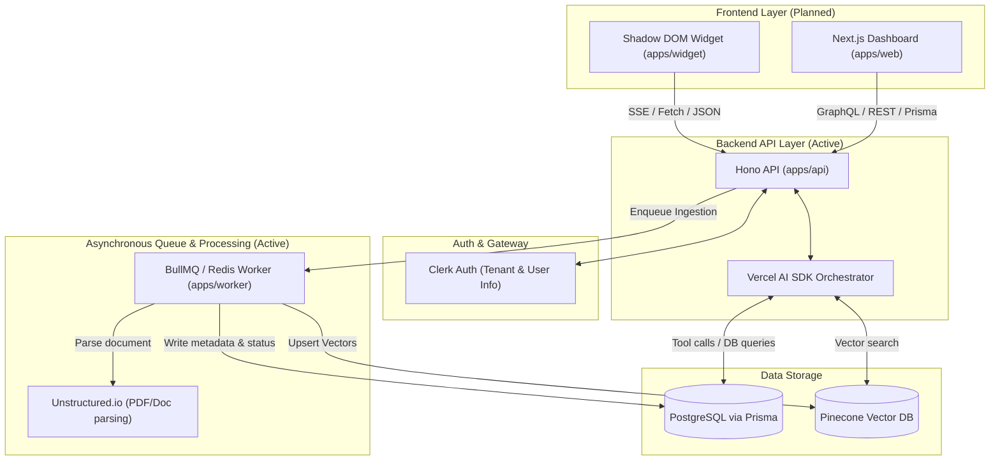

# Aegis AI: Autonomous Customer Support & Closed-Loop Escalation Platform

Aegis AI (also referred to as `agentify`) is a B2B, multi-tenant customer support platform designed around a state-of-the-art **Agentic Triage Loop**. Rather than acting as an unchecked answer generator, the AI operates as a Level-1 Support Dispatcher that evaluates its own retrieval confidence and routes low-confidence or complex queries to a human support desk, closing the knowledge gap dynamically.

---

## 📖 How Standard README Files Are Written

A standard README file serves as the entry point and primary documentation for a project. It is written using **Markdown (GFM)** and should follow a structured format to ensure readability, clarity, and ease of use:

1. **Title & Catchy Description:** State the project name clearly and explain what it does in one or two sentences.
2. **Problem Statement & Solution:** Clearly outline the pain point the project addresses and how the codebase solves it.
3. **Key Features:** Bullet points of the primary functional modules.
4. **Architecture / Diagram:** A visual representation (like Mermaid flowcharts) showing how data flows through the system.
5. **Technology Stack:** A list of frameworks, databases, and third-party services utilized.
6. **Getting Started & Prerequisites:** Clear instructions on system dependencies (Node.js, PNPM, Docker, etc.) and credentials needed.
7. **Installation, Configuration & Running instructions:** Step-by-step commands for cloning, configuring environment variables (`.env.example`), setting up databases/migration, and running the development environment.
8. **Project Structure:** A layout mapping the folder tree to help new developers navigate the codebase.

---

## 🌟 What the Project is About

Aegis AI is a TypeScript-based **Turborepo monorepo** designed to automate 75% of support queries while ensuring 100% accuracy via human-in-the-loop fallback. 

When a customer asks a query, the AI searches the organization’s secure vector knowledge base. If it cannot find the answer with high confidence, it initiates a **Doubt Gate** triage mechanism to automatically escalate the request to human support agents. Once resolved, the system harvests the resolution to update its vector database, preventing future failures on similar questions.

### The Product Flywheel
```
User Query ──► Agent Doubt ──► Human Ticket ──► Human Resolution ──► Re-ingested as FAQ ──► Zero Doubt on next query
```

---

## ⚡ What Problem it Solves

Traditional RAG (Retrieval-Augmented Generation) chatbots suffer from **hallucinations** and a lack of doubt. They attempt to answer queries they lack context for, eroding user trust.

Aegis AI solves this by introducing:
*   **Gate A (Vector Score Check):** A deterministic threshold check (e.g. `similarity_score >= 0.74`). Low confidence instantly triggers clarifying questions or ticket creation.
*   **Gate B (LLM Self-Assessment):** If context is found, the LLM determines whether it must guess/extrapolate to answer the query. If yes, it routes to human escalation.
*   **Closed-Loop Knowledge Harvesting:** Automatically suggests a synthetic markdown FAQ card from human agent resolutions, growing the knowledge base continuously.
*   **Tenant Data Isolation:** Enforces strict namespacing to prevent cross-tenant information leaks in both Vector (Pinecone) and Relational (PostgreSQL) databases.

---

## 🏗️ Architecture & Component Overview

The system is organized as a multi-app monorepo:



### Monorepo Structure & Status

| Workspace Path | Target Name | Status | Description |
| :--- | :--- | :--- | :--- |
| **`apps/api`** | [api](file:///home/krit/projects/DocyReply/agentify/apps/api) | **Active** | High-performance JSON API & Server-Sent Events (SSE) router built with [Hono](https://hono.dev/). Handles client sessions, ingestion requests, and webhooks. |
| **`apps/worker`** | [worker](file:///home/krit/projects/DocyReply/agentify/apps/worker) | **Active** | [BullMQ](https://bullmq.io/) worker processing layout-aware document ingestion jobs (parsing, embedding, and vector index upserts). |
| **`packages/db`** | [@repo/db](file:///home/krit/projects/DocyReply/agentify/packages/db) | **Active** | Shared database client module wrapping Prisma, Pinecone, and Redis instances. |
| **`packages/schemas`** | [@repo/schemas](file:///home/krit/projects/DocyReply/agentify/packages/schemas) | **Active** | Shared [Zod](https://zod.dev/) validation schemas across all applications. |
| `apps/web` | `@repo/web` | *Roadmap* | Dashboard UI for support reps and tenant admins. |
| `apps/widget` | `@repo/widget` | *Roadmap* | Embedded script and floating widget injected into target client DOMs. |

---

## 🛠️ Technology Stack & External Services

| Category | Technology / Service | Description |
| :--- | :--- | :--- |
| **Frameworks** | Node.js, [Hono](https://hono.dev/), [Next.js](https://nextjs.org/) | Core application runtimes and web layers. |
| **Monorepo Manager** | [Turborepo](https://turbo.build/repo), `pnpm` workspaces | Manages caching and execution pipelines. |
| **Databases** | PostgreSQL, [Prisma ORM](https://www.prisma.io/), Redis | Relational storage, query compiler, caching/queues. |
| **Vector DB** | [Pinecone Serverless](https://www.pinecone.io/) | Fast vector search isolated by tenant `namespace`. |
| **AI Inference** | [OpenRouter API](https://openrouter.ai/) | Orchestrates LLM triage (Nemotron models) and Embeddings. |
| **Authentication** | [Clerk](https://clerk.com/) | Multi-tenant organization roles and JWT security validation. |
| **Document Parser** | [Unstructured.io](https://unstructured.io/) | Preserves tables & narrative text structure during document chunking. |
| **Email Service** | [Resend](https://resend.com/) | Inbound email webhooks and replies routing. |

---

## ⚙️ Environment Variables Reference

Below are the key environment configurations required across `apps/api`, `apps/worker`, and `packages/db`:

| Variable Name | Required | Default / Format | Description |
| :--- | :--- | :--- | :--- |
| `PORT` | No | `3000` | Port for the Hono API server. |
| `NODE_ENV` | No | `development` | Environment mode (`development` or `production`). |
| `DATABASE_URL` | Yes | `postgresql://...` | Connection URI for the PostgreSQL/Neon database. |
| `REDIS_URL` | Yes | `redis://127.0.0.1:6379` | Connection URI for BullMQ caching and queues. |
| `PINECONE_API_KEY` | Yes | `pcsk_...` | API Key for Pinecone Vector database. |
| `PINECONE_INDEX` | Yes | `aegis-ai` | The serverless Pinecone index name to search/upsert. |
| `OPENROUTER_API_KEY`| Yes | `sk-or-v1-...` | API Key for model inference and text embeddings. |
| `UNSTRUCTURED_API_KEY`| Yes | `your-api-key` | API Key for Unstructured.io document parsing. |
| `UNSTRUCTURED_API_URL`| No | `https://api.unstructured.io/...` | Endpoint for layout-aware document extraction. |
| `CLERK_SECRET_KEY` | Yes | `sk_test_...` | Secretariat Key for Clerk authentication. |

---

## 🚀 Getting Started & Local Setup

### 📋 Prerequisites
*   Node.js >= `18.x`
*   pnpm >= `9.x`
*   Docker (Optional, but recommended for local Postgres & Redis services)

### 1. Spin up Local Database & Redis (Optional)
If you don't have existing Postgres and Redis services, run them via Docker:
```bash
docker run --name aegis-postgres -e POSTGRES_PASSWORD=postgres -p 5432:5432 -d postgres:15
docker run --name aegis-redis -p 6379:6379 -d redis:7
```

### 2. Clone & Install Dependencies
Run the following command in the project root:
```bash
pnpm install
```

### 3. Configure Environment Variables
Copy the `.env.example` in the respective workspaces to `.env` files:
```bash
cp apps/api/.env.example apps/api/.env
cp packages/db/.env.example packages/db/.env
```
Open each `.env` file and insert your API keys and connection URLs.

### 4. Setup Prisma Schema
Sync the database with the Prisma schema and compile DB client types:
```bash
# Generate Client SDK
pnpm --filter @repo/db generate

# Push changes to database
pnpm --filter @repo/db db:push
```

### 5. Start Development Servers
To run both Hono API and BullMQ worker in dev mode:
```bash
pnpm dev
```
*   **Hono API Server:** runs at `http://localhost:3000`
*   **Worker Process:** starts polling Redis for document parsing queues.

---

## 🔌 API Quick Start Examples

Below are standard operations to test your API locally using `curl`:

### Health Check
Verify API server operational status:
```bash
curl http://localhost:3000/health
```

### Upload a Document for Vector Ingestion
Add knowledge data to the agent (requires a mocked/active header context):
```bash
curl -X POST http://localhost:3000/api/orgs/documents \
  -H "x-mock-org-id: org-local-test" \
  -H "x-mock-role: admin" \
  -F "file=@/path/to/billing_faq.pdf"
```

---

## 🧪 Testing & Linting
Run standard Turborepo commands across all workspaces:
```bash
# Run ESLint validation
pnpm lint

# Run typescript compilation validation
pnpm check-types

# Run tests
pnpm test
```
